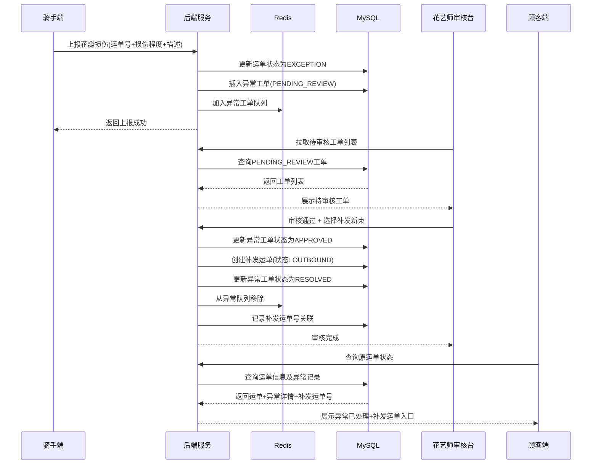
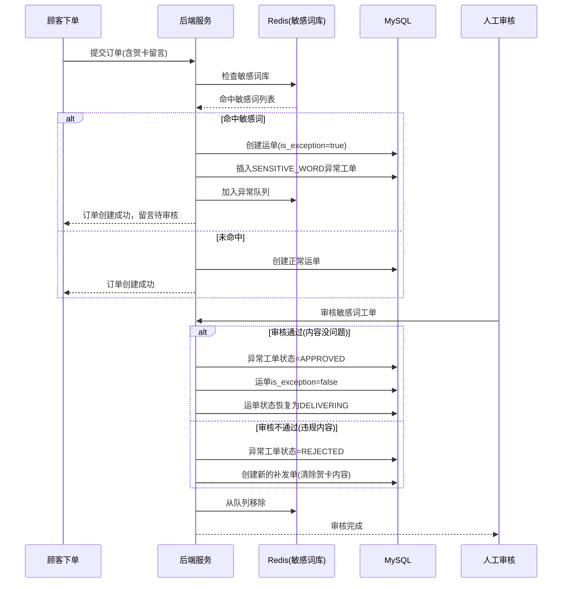
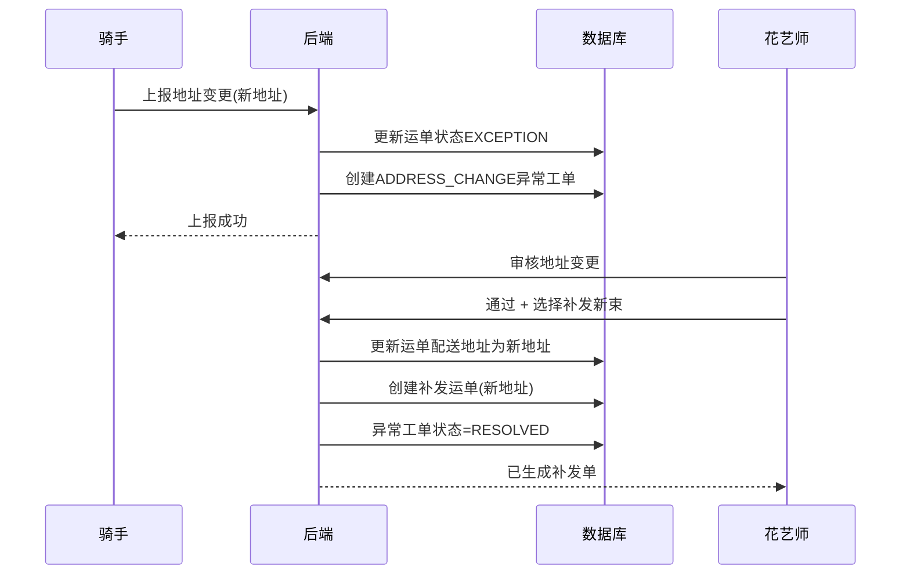

# 🌹 情人节鲜花配送可视化后台

基于 **Spring Boot + React + MySQL + Redis** 构建的鲜花配送全流程可视化管理系统。

## ✨ 功能特性

### 顾客端
- 🔍 运单号查询配送状态
- ⏱️ **时间轴展示**四段状态：花店出库 → 冷链装车 → 派送中 → 已签收
- 🗺️ **地图折线**实时展示骑手GPS轨迹
- 🔄 位置自动刷新（5秒间隔）

### 骑手端
- 📋 查看今日配送订单列表
- 📍 **Mock GPS 上报**（按固定路径模拟）
- ⚡ 支持手动/自动两种上报模式
- 🔔 一键上报异常（花瓣损伤 / 收件人改址）
- 🔐 签收码验证（3次错误锁定10分钟）

### 管理后台
- 📦 **订单全流程管理**：出库 → 装车 → 分配骑手 → 派送
- 🔍 按状态筛选 / 关键词搜索
- 📊 订单数量统计看板
- 📋 订单详情与状态流转日志

### 审核后台
- 📝 **异常工单审核**（值班花艺师）
- 🌺 花瓣损伤：补发新束 / 部分退款 / 全额退款
- 🏠 地址变更：确认新地址后重新派送
- 🔒 敏感词检测：贺卡留言命中暂存人工队列

## 🏗️ 技术架构

```
┌─────────────┐     ┌──────────────┐     ┌──────────────┐
│  React 前端 │────▶│ Spring Boot  │────▶│  MySQL 8.0   │
│  (3000端口) │     │  (8080端口)  │     │  持久化存储  │
└─────────────┘     └──────────────┘     └──────────────┘
                           │
                           ▼
                    ┌──────────────┐
                    │   Redis 7    │
                    │  缓存/队列   │
                    └──────────────┘
```

## 🚀 快速启动

### 方式一：Docker Compose（推荐）

```bash
# 一键启动所有服务
docker-compose up -d

# 查看服务状态
docker-compose ps

# 查看日志
docker-compose logs -f backend
docker-compose logs -f frontend
```

启动后访问：
- 前端页面：http://localhost:3000
- 后端API：http://localhost:8080/api

### 方式二：本地开发

**后端**：
```bash
cd backend
mvn spring-boot:run
```

**前端**：
```bash
cd frontend
npm install
npm run dev
```

## 📊 数据库表结构

### delivery_order - 运单表
| 字段 | 类型 | 说明 |
|------|------|------|
| id | BIGINT | 主键 |
| order_no | VARCHAR(32) | 订单号 |
| tracking_no | VARCHAR(32) | 运单号 |
| status | VARCHAR(32) | 状态：PENDING/OUTBOUND/LOADED/DELIVERING/DELIVERED/EXCEPTION |
| is_exception | TINYINT | 是否异常 |
| exception_type | VARCHAR(32) | 异常类型 |

### gps_point - GPS点位表
- tracking_no: 关联运单号
- latitude / longitude: 经纬度
- sequence: 上报序号
- report_time: 上报时间

### exception_order - 异常工单表
- exception_type: PETAL_DAMAGE / ADDRESS_CHANGE / SENSITIVE_WORD
- status: PENDING_REVIEW / APPROVED / REJECTED / RESOLVED
- resolution_type: REISSUE / PARTIAL_REFUND / FULL_REFUND / NONE

### sensitive_word - 敏感词表
- word: 敏感词
- category: 分类
- enabled: 是否启用

### order_status_log - 状态日志表
- 记录每次状态变更历史

## 🔄 异常工单闭环序列图

### 场景1：花瓣损伤审核流程



### 场景2：敏感词人工审核流程



### 场景3：地址变更处理流程



## 📦 API 接口清单

### 订单相关
| 方法 | 路径 | 说明 |
|------|------|------|
| POST | /api/orders | 创建订单 |
| GET | /api/orders/tracking/{trackingNo} | 根据运单号查询 |
| GET | /api/orders/orderNo/{orderNo} | 根据订单号查询 |
| PUT | /api/orders/{trackingNo}/status | 更新订单状态 |
| GET | /api/orders/{trackingNo}/logs | 获取状态变更日志 |
| GET | /api/orders/{trackingNo}/sign-status | 查询签收状态（是否锁定、剩余次数） |
| POST | /api/orders/{trackingNo}/sign | 签收验证码校验并完成签收 |

### GPS相关
| 方法 | 路径 | 说明 |
|------|------|------|
| POST | /api/gps/report | 上报GPS点位 |
| GET | /api/gps/latest/{trackingNo} | 获取最新位置 |
| GET | /api/gps/track/{trackingNo} | 获取完整轨迹 |

### 异常工单相关
| 方法 | 路径 | 说明 |
|------|------|------|
| POST | /api/exceptions | 创建异常工单 |
| GET | /api/exceptions/pending | 获取待审核列表 |
| GET | /api/exceptions/{id} | 获取工单详情 |
| POST | /api/exceptions/{id}/review | 审核工单 |

### Mock数据
| 方法 | 路径 | 说明 |
|------|------|------|
| POST | /api/mock/gps/init | 初始化模拟GPS轨迹 |
| POST | /api/mock/gps/report | 按序号上报模拟GPS |
| GET | /api/mock/route | 获取默认模拟路径 |

## 📁 项目结构

```
tl-0008-1/
├── backend/                 # Spring Boot 后端
│   ├── src/main/java/com/flowerdelivery/
│   │   ├── entity/         # 实体类
│   │   ├── repository/     # 数据访问层
│   │   ├── service/        # 业务逻辑层
│   │   ├── controller/     # 控制层
│   │   └── config/         # 配置类
│   ├── src/main/resources/
│   │   └── application.yml # 应用配置
│   └── Dockerfile
│
├── frontend/               # React 前端
│   ├── src/
│   │   ├── pages/          # 页面组件
│   │   ├── services/       # API服务
│   │   ├── App.jsx
│   │   └── main.jsx
│   ├── nginx.conf
│   └── Dockerfile
│
├── docker/                 # Docker 配置
│   ├── mysql/
│   │   └── init.sql        # 数据库初始化脚本
│   └── redis/
│       └── warmup.sh       # Redis 缓存预热脚本
│
├── test-data/              # 测试数据
│   └── test-orders.json    # 5组测试运单
│
├── docker-compose.yml      # 一键部署
└── README.md
```

## 🔧 Redis 缓存键说明

| 键名 | 类型 | 说明 |
|------|------|------|
| flower:order:{trackingNo} | String | 运单当前状态 |
| flower:order:no:{orderNo} | String | 订单号映射运单号 |
| flower:gps:latest:{trackingNo} | String | 最新GPS位置(JSON) |
| flower:gps:track:{trackingNo} | List | GPS轨迹列表 |
| flower:sensitive:words | Set | 敏感词库 |
| flower:exception:queue | Set | 待审核异常工单ID集合 |
| flower:system:* | String | 系统配置 |
| flower:stats:* | String | 统计数据 |
| flower:rider:{id}:* | String | 骑手信息 |

## 🧪 测试数据

详细测试运单请参考 [test-orders.json](./test-data/test-orders.json)，包含 5 组含损伤场景的测试用例：

1. **轻微花瓣损伤** - 1-2朵受损，建议部分退款
2. **中度花瓣损伤** - 3-5朵受损，建议补发新束
3. **严重花瓣损伤** - 整束受损，建议全额退款
4. **敏感词命中** - 贺卡留言违规，需人工审核
5. **地址变更** - 收件人临时改址，需确认重派

## 💡 使用说明

### 演示流程推荐

1. 打开 **下单页面**，创建一笔新订单（可尝试填写包含敏感词的贺卡留言）
2. 打开 **顾客端**，输入运单号查看配送状态
3. 打开 **骑手端**，选择订单开始派送
   - 点击"初始化模拟轨迹"
   - 点击"开始自动上报"观察GPS移动
4. 骑手端可点击"上报异常"，选择花瓣损伤或地址变更
5. 打开 **审核后台**，对待审核工单进行审核
6. 回到顾客端查看异常处理结果

### 默认演示账号/数据

| 项目 | 值 |
|------|-----|
| 演示运单号 | FD0214ABCD12 |
| 演示运单号 | FD0214CDEF34 |
| 异常运单号 | FD0214EFGH56 |
| 骑手ID | RIDER001 / RIDER002 / RIDER003 |
| 花艺师审核员 | FLORIST001 李花艺师 |

## 📝 注意事项

- 地图使用 OpenStreetMap 免费瓦片，需联网
- GPS 轨迹为模拟数据，路径固定用于演示
- 敏感词检测基于 Redis Set，可通过接口动态添加
- 所有时间均使用 Asia/Shanghai 时区

## 🔐 签收验证码

运单进入派送中（DELIVERING）状态时，系统自动生成 6 位数字签收码，同时写入数据库和 Redis（TTL 24 小时）。

- **顾客端**：派送中状态下展示签收码，供收件人告知骑手
- **骑手端**：确认签收时需输入正确签收码，连续 3 次错误锁定 10 分钟
- **状态查询**：`GET /api/orders/{trackingNo}/sign-status` 可查询锁定状态

### Redis 键说明

| 键名 | 类型 | TTL | 说明 |
|------|------|-----|------|
| flower:sign:{trackingNo} | String | 24h | 签收验证码 |
| flower:sign:fail:{trackingNo} | String | 10min | 错误次数计数 |

### curl 演示

**前置条件**：运单 `FD0214ABCD12` 处于 DELIVERING 状态。

#### 1. 查询签收状态

```bash
curl -X GET http://localhost:8080/api/orders/FD0214ABCD12/sign-status
```

返回示例：
```json
{
  "success": true,
  "data": {
    "exists": true,
    "status": "DELIVERING",
    "isDelivering": true,
    "isDelivered": false,
    "failCount": 0,
    "isLocked": false,
    "lockRemainingSeconds": 0
  }
}
```

#### 2. 正确签收（先查码再验证）

```bash
# 先查询运单获取签收码（模拟顾客端查看）
curl -X GET http://localhost:8080/api/orders/tracking/FD0214ABCD12

# 使用正确签收码完成签收（模拟骑手端）
curl -X POST http://localhost:8080/api/orders/FD0214ABCD12/sign \
  -H "Content-Type: application/json" \
  -d '{
    "signCode": "123456",
    "riderId": "RIDER001",
    "riderName": "王师傅"
  }'
```

返回示例（成功）：
```json
{
  "success": true,
  "code": 200,
  "message": "签收成功",
  "data": { ... }
}
```

#### 3. 错误三次锁定

```bash
# 第 1 次输错
curl -X POST http://localhost:8080/api/orders/FD0214ABCD12/sign \
  -H "Content-Type: application/json" \
  -d '{"signCode":"000000","riderId":"RIDER001","riderName":"王师傅"}'

# 第 2 次输错
curl -X POST http://localhost:8080/api/orders/FD0214ABCD12/sign \
  -H "Content-Type: application/json" \
  -d '{"signCode":"111111","riderId":"RIDER001","riderName":"王师傅"}'

# 第 3 次输错 → 触发锁定，返回 429
curl -X POST http://localhost:8080/api/orders/FD0214ABCD12/sign \
  -H "Content-Type: application/json" \
  -d '{"signCode":"222222","riderId":"RIDER001","riderName":"王师傅"}'
```

第 3 次返回示例（HTTP 429）：
```json
{
  "success": false,
  "code": 429,
  "message": "签收验证失败次数过多，请600秒后重试",
  "lockRemainingSeconds": 600,
  "failCount": 3
}
```

#### 4. 冷却结束后重试

锁定期间查询状态会显示剩余冷却时间：

```bash
curl -X GET http://localhost:8080/api/orders/FD0214ABCD12/sign-status
```

返回示例（锁定中）：
```json
{
  "success": true,
  "data": {
    "isLocked": true,
    "failCount": 3,
    "lockRemainingSeconds": 542
  }
}
```

等待 10 分钟后自动解锁，可重新输入正确签收码完成签收。
